# Overview

1. UML definition
2. Why UML?
3. UML Overview
4. Structure Diagrams
- Class Diagram
- Package Diagram
- Collaboration Diagram
- Deployment Diagram
- Component Diagram

5. Dynamic Diagrams
- Use Case Diagram
- Activity Diagram
- Sequence Diagram
- State Diagram

## UML definition
Unified Modeling Language, UML is not a method or process but the Univied Development is.

## Why UML?
- Reduces risks by documenting assumptions
  - domain models, requirements, architecture, design, implementation, ... 
- Represents industry standard
  -	more tool support, more people understand your diagrams, less education needed 
-	Is reasonably well-defined although there are interpretations and dialects 
-	Is open -> stereotypes, tags and constraints to extend basic -> constructs has a meta-meta-model for advanced extensions 

## UML Overview

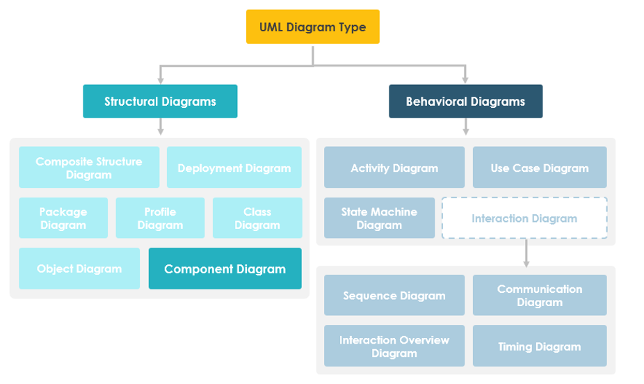

# Structure Diagrams
Structure diagrams show the static structure of the system and its parts on different abstraction and implementation levels and how they are related to each other. The elements in a structure diagram represent the meaningful concepts of a system, and may include abstract, real world and implementation concepts.!

## Class Diagram
Represents the static structure of the system in terms of classes and their relations. 
Shows static structure of the designed system, subsystem or component as related classes and interfaces, with their features like their attributes, operations (or methods), constraints and relationships - associations, generalizations, dependencies, etc. They detail how types are defined and structurally related.

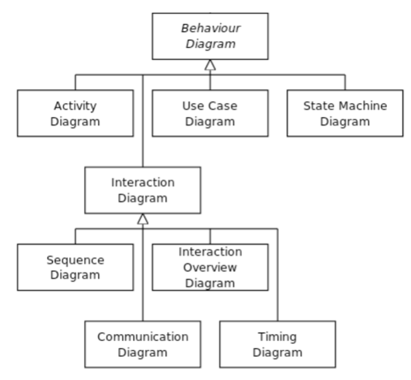

**Pros**
- Useful to represent how types are defined and related 
- They are useful to capture the essence of one or more design decisions 

**Cons**
- Poor vehicle for capturing any run- time property of the code 

## Package Diagram
Shows packages and relationships between the packages. Also shows Structure and dependencies between sub-systems or modules. Is used to simplify complex class diagrams, you can group classes into packages. A package is a collection of logically related UML elements.

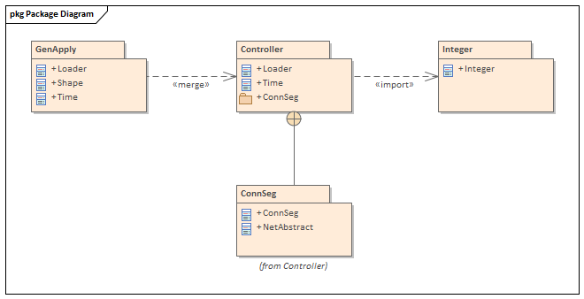

## Collaboration Diagram
Is a spatial representation of objects, relations, and interactions. 
The collaboration diagram is used to show the relationship between the objects in a system. Shows scenarios as flows of messages between objects. Both, sequence and collaboration diagrams represent the same information but differently. 

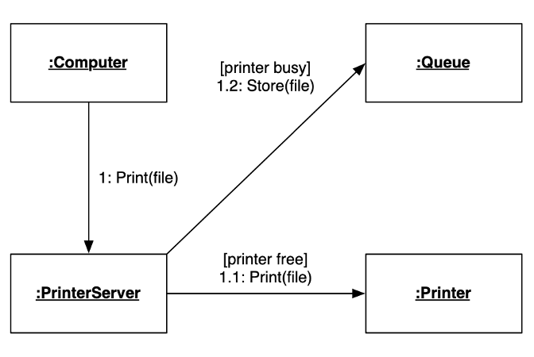

## Deployment Diagram
Represents the deployment of a system on hardware. 
The deployment diagram visualizes the physical hardware on which the software will be deployed. It portrays the static deployment view of a system. It involves the nodes and their relationships. It ascertains how software is deployed on the hardware. It maps the software architecture created in design to the physical system architecture, where the software will be executed as a node. Since it involves many nodes, the relationship is shown by utilizing communication paths.

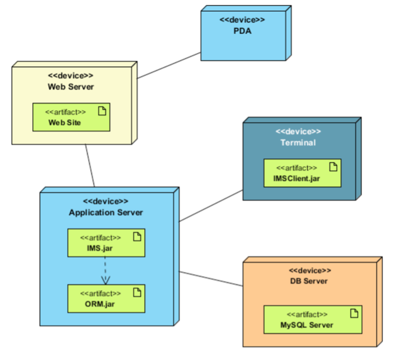

## Object Diagram
Represents objects and their relations; corresponds to simplified collaboration diagrams (no message sends). 
Object diagrams show particular instantiations of systems and their behavior”. A UML object diagram represents a specific instance of a class diagram at a certain moment in time. When represented visually, you'll see many similarities to the class diagram. An object diagram focuses on the attributes of a set of objects and how those objects relate to each other.

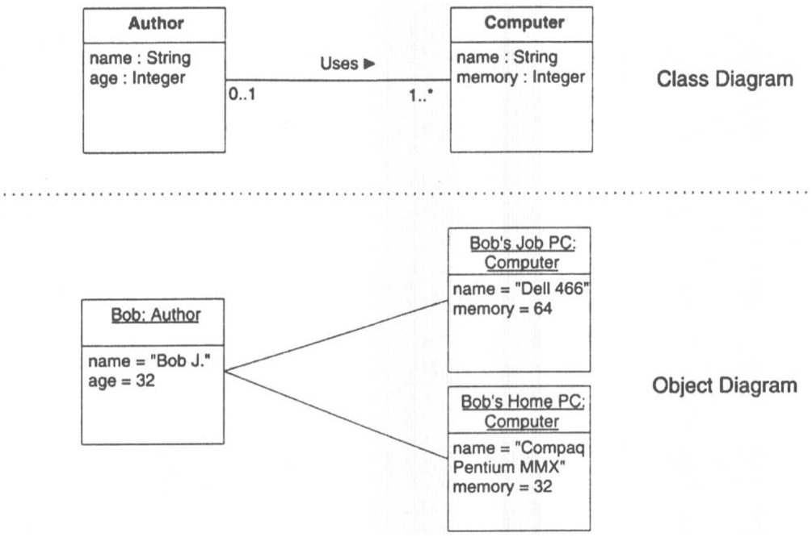

## Component Diagram
Represents the physical components of a system. 
A component diagram breaks down the actual system under development into various high levels of functionality. Each component is responsible for one clear aim within the entire system and only interacts with other essential elements on a need-to-know basis.

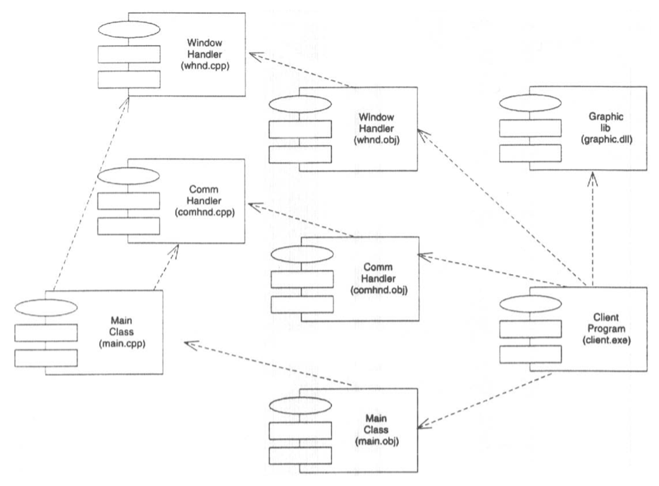

# Behavior Diagrams
Behavior diagrams show the dynamic behavior of the objects in a system, which can be described as a series of changes to the system over time.

## Use Case Diagram
Represents the functionality of the system from the point of the user of that system. 
A use case is a generic description of an entire transaction involving several actors. A use case diagram presents a set of use cases (ellipses) and the external actors that interact with the system. Dependencies and associations between use cases may be indicated. A use case is a snapshot of one aspect of your system. The sum of all use cases is the external picture of your system. As use cases appear, assess their impact on the domain model. A domain model in software engineering is a conceptual model of all the topics related to a specific problem. Use cases can drive domain modeling by highlighting the key concepts 

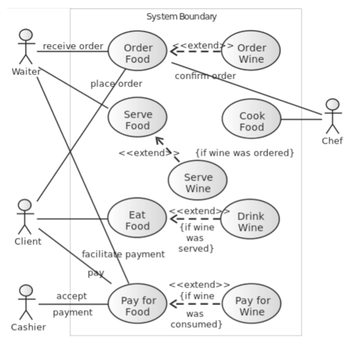

## Activity Diagram
Represents the behavior of one operation in terms of actions. 
An activity diagram models the control flow (i.e., execution states) of a computation or Workflow (within the system rather than the implementation). In other words: an object-oriented flowchart. Activity diagrams can express collaboration. Swimlanes group activities by responsibilities. Object flows depict objects that are the outputs or inputs of activities 

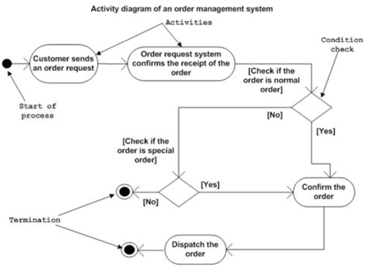

## Sequence Diagram
Is a temporal representation of objects and their interaction. 
A sequence diagram depicts a scenario by showing the interactions among a set of objects in Temporal order. Objects (not classes!) are shown as vertical bars. Events or message dispatches are shown as horizontal (oder DE: schräg) arrows from the sender to the receiver. Message flow is represented by a vertical dotted line that extends across the bottom of the page.

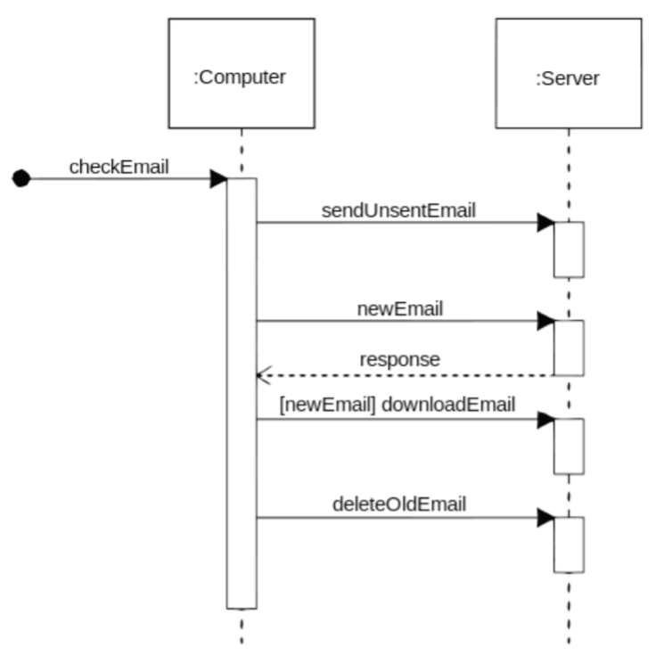

## State Diagram
Represents the behaviour of a class in terms of (evolution of) its state. 
The state machine diagram is also called the Statechart or State Transition diagram, which shows the order of states underwent by an object within the system. It captures the software system's behavior. It models the behavior of a class, a subsystem, a package, and a complete system.
It tends out to be an efficient way of modeling the interactions and collaborations in the external entities and the system. It models event-based systems to handle the state of an object. It also defines several distinct states of a component within the system. Each object/component has a specific state.
Following are the types of a state machine diagram that are given below:

**1.	Behavioral state machine**
The behavioral state machine diagram records the behavior of an object within the system. It depicts an implementation of a particular entity. It models the behavior of the system.
**2.	Protocol state machine**
It captures the behavior of the protocol. The protocol state machine depicts the change in the state of the protocol and parallel changes within the system. But it does not portray the implementation of a particular component.

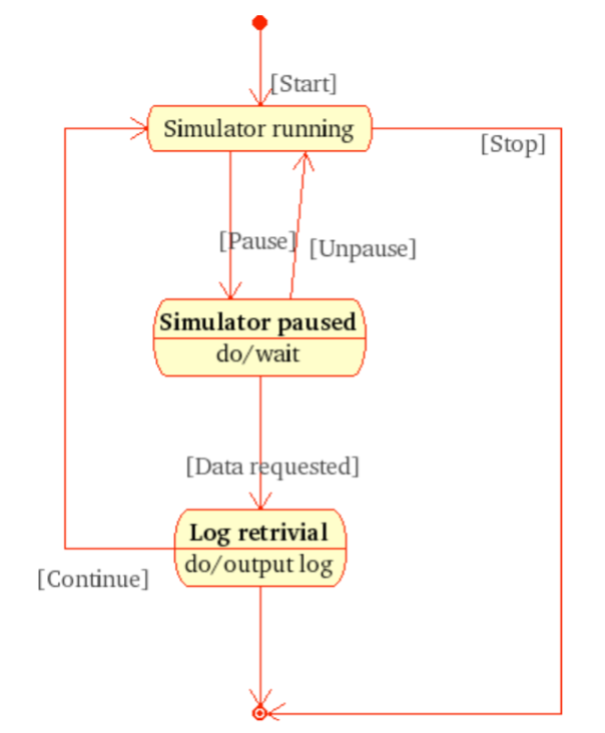

## Statechart Diagrams

### Notation
-	A statechart diagram describes the temporal evolution of an object of a given class in response to interactions with other objects inside or outside the system 
-	An event is a one-way (asynchronous) communication from one object to another
  	-	atomic (non-interruptible) 
  	-	includes events from hardware and real-world objects, e.g., message receipt, input event, elapsed time, etc.
  	-	notation: eventName(parameter: type, ...) 
  	-	may cause object to make a transition between states 
-	A state is a period of time during which an object is waiting for an event to occur
-	depicted as rounded box with (up to) three sections 
  	-	name – optional
  	-	state variables - name: type = value (valid only for that state)
  	-	triggered operations - internal transitions and ongoing operations 
-	may be nested 

### State Box with Regions 
-	The entry event occurs whenever a transition is made into this state, and the exit operation is triggered when a transition is made out of this state
-	The help and character events cause internal transitions with no change of state, so entry and exit operations are not performed 

### Transiations
A transition is a response to an external event received by an object in a given state 
-	May invoke an operation, and cause the object to change state 
-	May send an event to an external object 
-	Transition syntax (each part is optional): event(arguments) [condition] / ^target.sendEvent operation(arguments) 
-	External transitions label arcs between states 
-	Internal transitions are part of the triggered operations of a state 

### Operations and Activities 
-	An operation is an atomic action invoked by a transition 
-	Entry and exit operations can be associated with states 
-	An activity is an ongoing operation that takes place while object is in a given state 
-	Modeled as “internal transitions” labeled with the pseudo-event “do” 

### Composite States 
-	Composite states may be depicted either as high- 
-	level or low-level views “Stubbed transitions” indicate the presence of internal states:
  	-	Internal and terminal substates are shown as black spots and “bulls-eyes” 

### Branching and Merging 
-	Entering concurrent substates
	- Entering a state with concurrent substates means that each of the substates is entered concurrently (one logical thread per substate) 
-	Leaving concurrent substates
  	- A labeled transition out of any of the substates terminates all of the substates 
  	- An unlabeled transition out of the overall state waits for all the substates to terminate 

### Using UML – Perspectives
Three perspectives in drawing UML diagrams 
1.	Conceptual 
  	a.	Represent domain concepts 
  	b. 	ignore software issues 
2.	Specification
  	a.	Focus on visible interfaces and behavior 
  	b.	ignore internal implementation 
3.	Implementation 
  	a.	Document implementation choices 
  	b.	Most common, but least useful (!) 

## Disclaimer
I do not own those pictures. This repo is only for studying purposes.
